# **Challenges of Scaling Kubernetes in the Hybrid Cloud**

## Introduction

Let's assume you're in the online business. You have your own datacenter, you have a private cloud running your website, hence a number of servers deployed to run applications and store their data.

The overall website traffic is somehow constant, still there are times in a year where you expect traffic growth. The first thing that comes to mind is that you need to scale some off your applications in order to cope with this traffic increase. As you don't want to spend money on new hardware which you'll use few times per year you think of moving to a [hybrid cloud](https://searchcloudcomputing.techtarget.com/definition/hybrid-cloud).

This can be a real time and cost saver. Scaling (parts of) your application to public cloud will allow you to pay only the resources you use, for the time you use them.

But how do you choose that public cloud? Can you choose more than one?

Short answer is yes. 
You have different teams, working on different applications, having different and vast requirements. One cloud provider may not fit all the criteria. In addition to this, some organizations need to follow certain laws, regulations and policies which dictate their data to physically reside in certain locations. So this strategy of having more than one public cloud can help organizations meet those requirements. They can also select from multiple data center regions or availability zones, to be as close to their end users as possible, providing them optimal performance and minimal latency.

## Challenges of scaling across multiple cloud providers

You've decided now upon the cloud(s) to use, so you go back and think about the initial problem. You have an application with a microservice deployment architecture, running containers and this needs to be scaled. Here is where Kubernetes comes into play. Essentially Kubernetes is a solution which helps you manage and orchestrate containerized applications in a cluster of nodes. 

A Kubernetes cluster is a set of machines (physical/virtual), resourced by Kubernetes to run applications.
- [Pods](https://kubernetes.io/docs/concepts/workloads/pods/pod/) are units that control one or more containers, scheduled as one application. Typically you should create one Pod per application, so you can scale and control them separately.
- [Node components](https://kubernetes.io/docs/concepts/architecture/nodes/#what-is-a-node) are worker machines in Kubernetes. A node may be a virtual machine (VM) or physical machine, depending on the cluster. Each node contains the services necessary to run pods and is managed by the master components.
- [Master components](https://kubernetes.io/docs/concepts/overview/components/#master-components) manage the lifecycle of a Pod. If a Pod dies, the Controller creates a new one, if you scale up/down Pods, the Controller creates/destroys your Pods. More on the controller types you can find [here](https://kubernetes.io/docs/concepts/workloads/controllers/replicaset/)

The role of these three components is to scale and schedule containers. The master component dictates the scheduling and scaling commands. The nodes then orchestrate the pods accordingly.

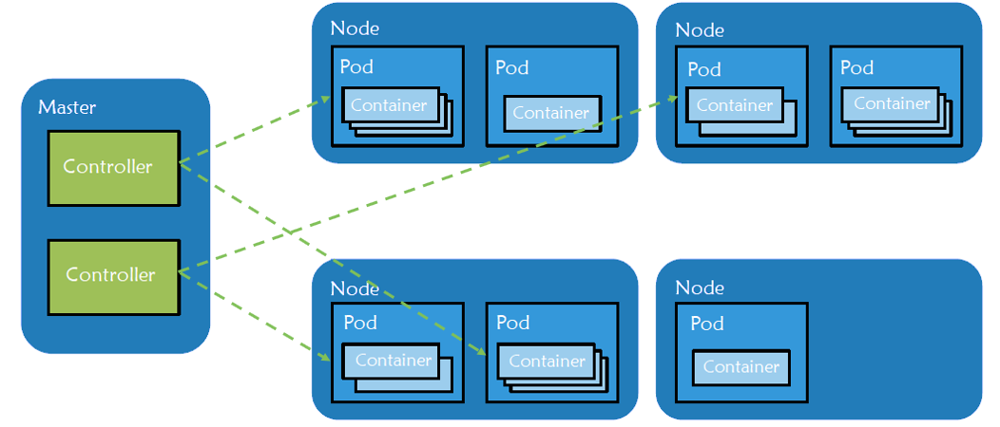

These are only the basics of Kubernetes, for a more detailed understanding you can go check this [article](https://rancher.com/blog/2018/2018-09-07-introduction-to-kubernetes/).

Few challenges that come to mind when trying to use Kubernetes, even in a managed way:
- Difficult to manage multiple clouds, multiple clusters, set users, set policies
- Complexity of installation and configuration
- Different experiences for users/teams depending on environment 

Here’s where [Rancher](https://rancher.com/) can help you. Rancher is an open source container manager used to run Kubernetes in production. Below are some features that Rancher provides:
- common infrastructure management across multiple clusters and clouds
- easy-to-use interface for Kubernetes configuration and deployment 
- easy to scale Pods and clusters with few simple clicks
- access control and user management (ldap, AD)
- workload, RBAC, policy and project management

Rancher becomes your single point of control for multiple clusters, maybe running on multiple clouds, on pretty much any infrastructure that can run Kubernetes.
Let's see now how we can use it in order to manage more than one cluster, in two different regions.

## Starting a Rancher 2.0 instance

To begin, start a Rancher 2.0 instance. There is a very intuitive getting started guide for this purpose [here](https://rancher.com/quick-start/).

## Hands-on with Rancher and Kubernetes
Let’s create two hosted Kubernetes clusters in GCP, in two different regions. For this you will need a service account [key](https://cloud.google.com/iam/docs/creating-managing-service-account-keys).
In Global Tab, we can see all the available clusters and their state. From `Provisioning` state, when ready, they should turn to `Active`.
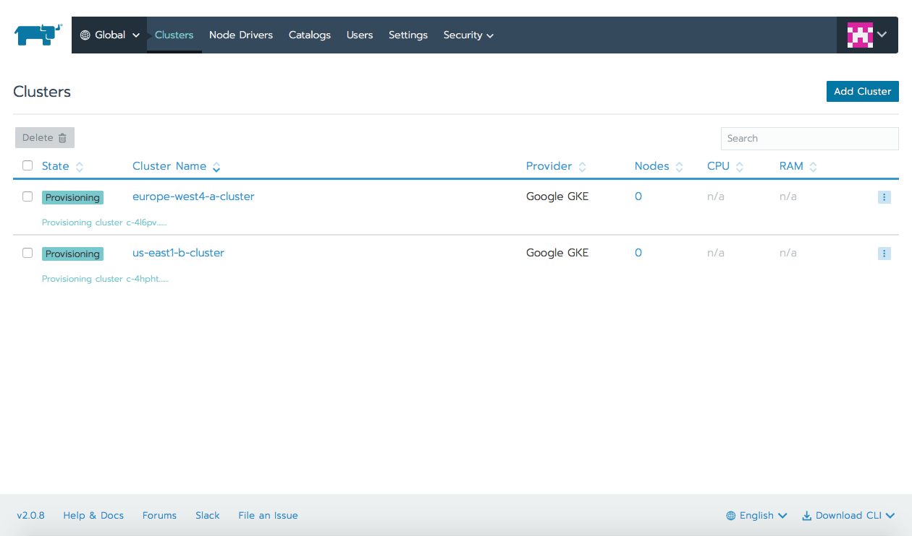

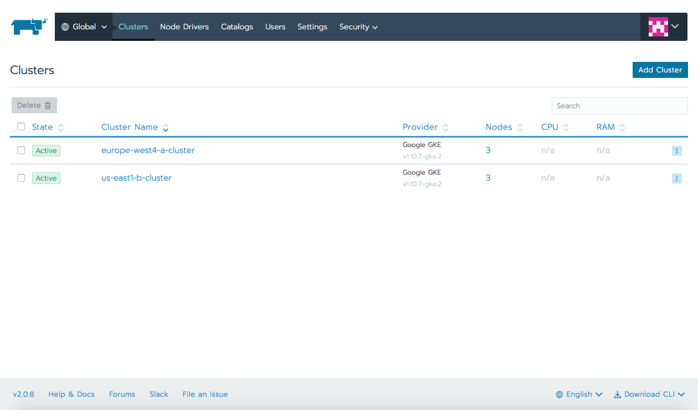

A number of pods are already deployed to each node from your Kubernetes Cluster. Those pods are used by Kubernetes and Rancher's internal systems. 

Let’s proceed deploying Workloads for both the clusters. Sequentially select Default project, this will open the Workloads tab. Click on Deploy and set the Name and the Docker image to be `httpd` for first cluster, `nginx` for second one. As we want to expose our webservers to internet traffic in the `Port mapping area select a `Layer-4 Load Balancer`.
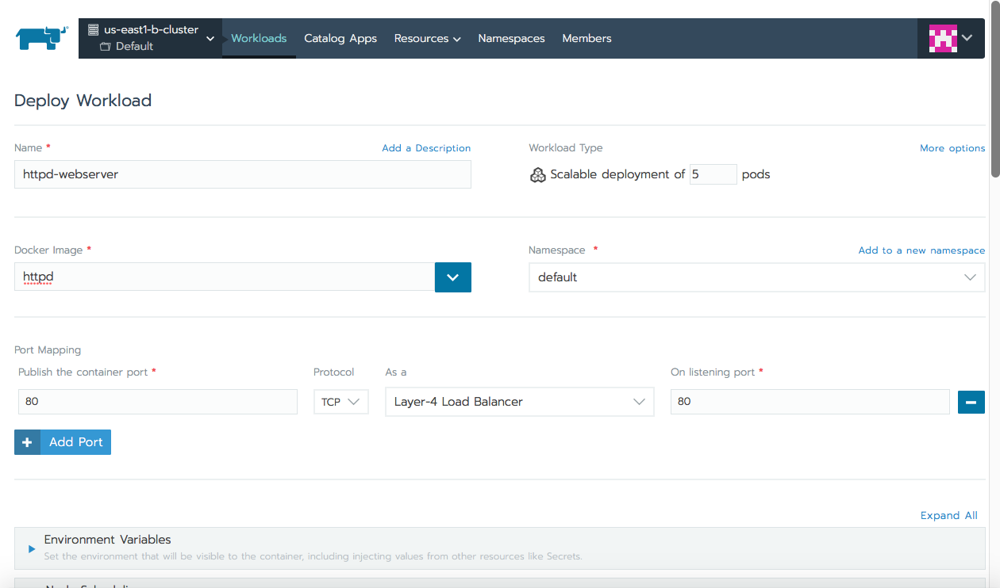
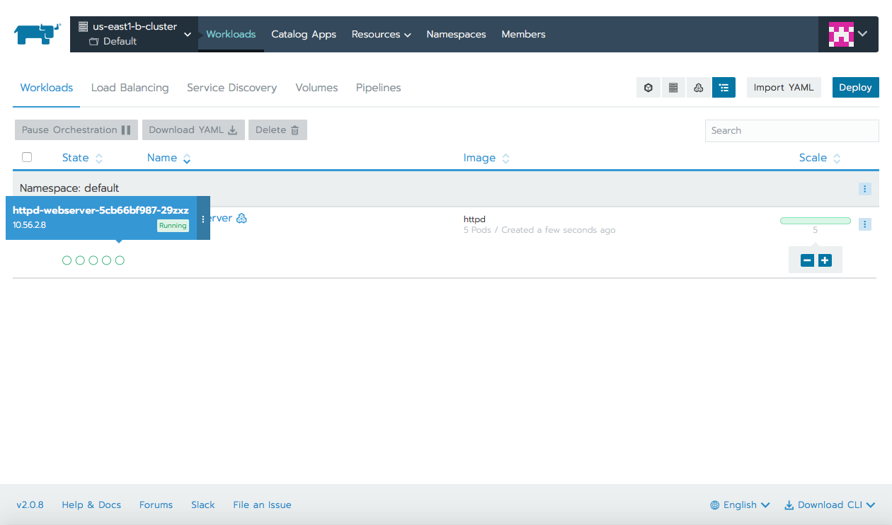
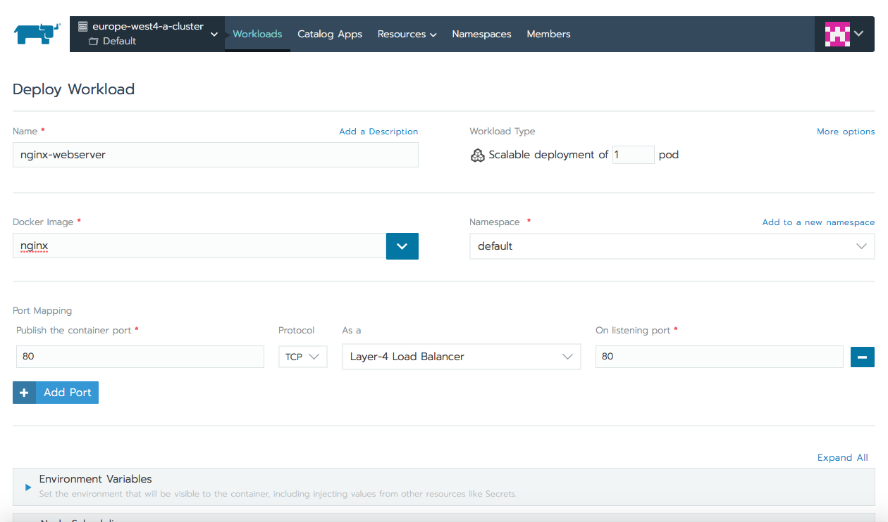
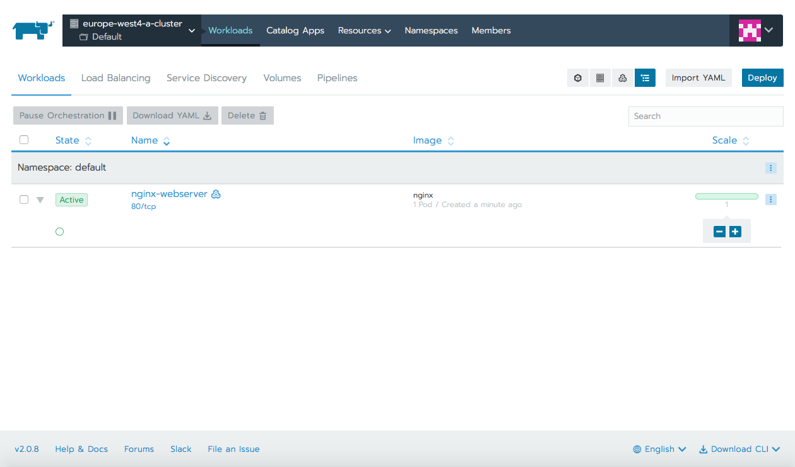

If you click on nginx/httpd workload, you will see that Rancher actually created a Deployment just as recommended by Kubernetes to manage ReplicaSets. You will also see the Pod created by that ReplicaSet.

### Scaling Pods and clusters

Our Rancher instance is managing two clusters:
- us-east1b-cluster, running 5 httpd Pods
- europe-west4-a cluster, running 1 nginx Pod

Let's scale down some httpd Pods by clicking on `-` under Scale column. In no time we see the number of Pods decrease.
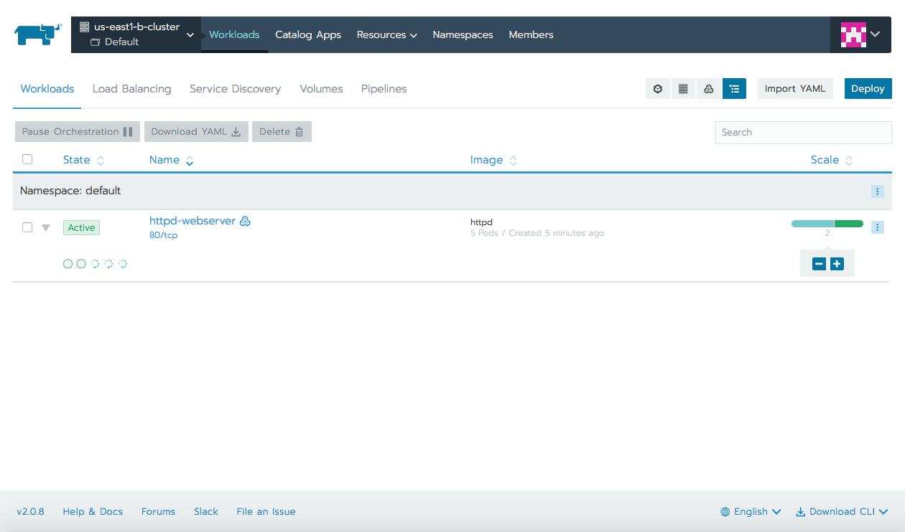
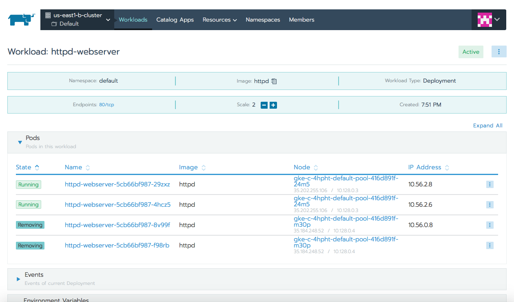

To scale up Pods click `+` under Scale column. Once you do that, you should instantly see Pods being created and ReplicaSet scaling events. Try to delete one of the pods, by using the right-hand side menu of the Pod and notice how ReplicaSet is recreating it back, to match the desired state.
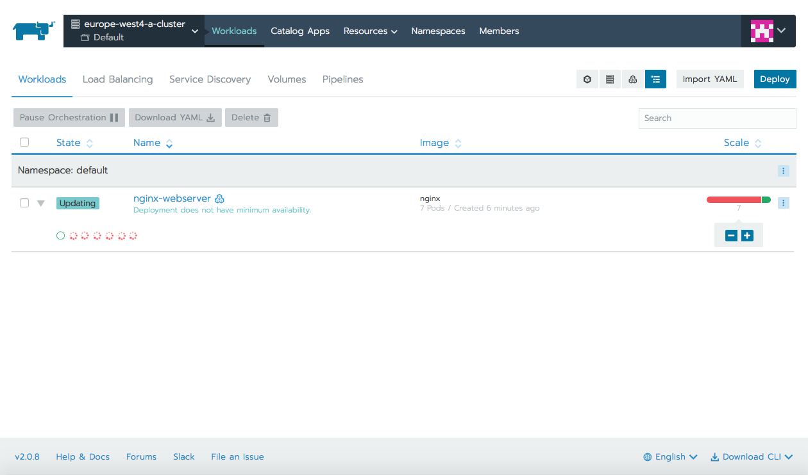
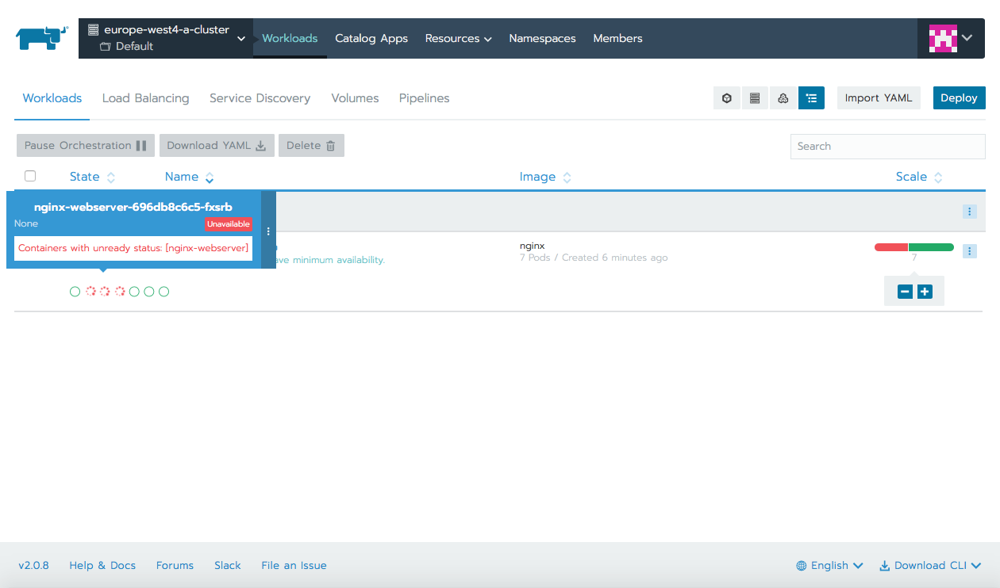

So, we went from 5 httpd Pods to 2 for first cluster, and from 1 nginx Pod to 7 Pods for second one. Second cluster looks now almost to be running out of resources.
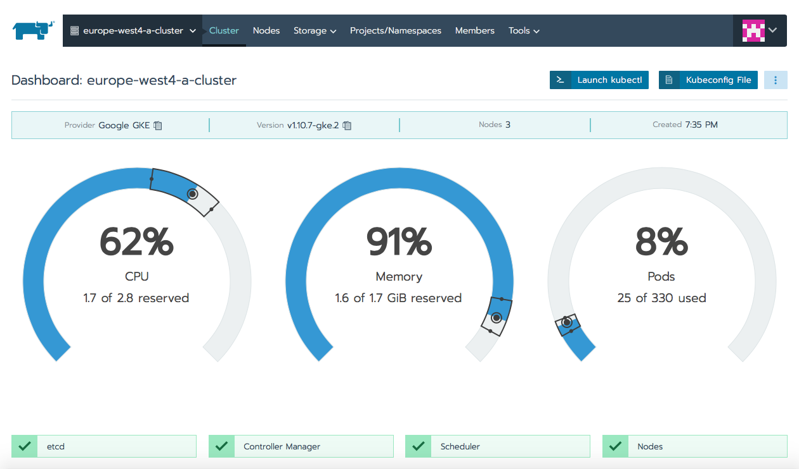

From Rancher we can also scale the cluster by adding extra Nodes. Let’s try do that, let’s edit the node count to 5.
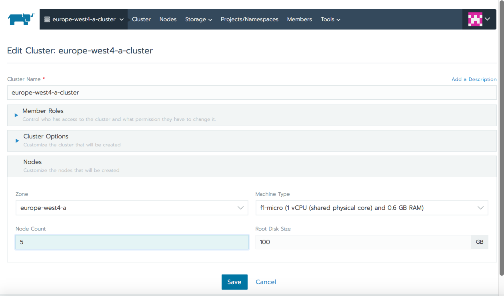

While Rancher shows us “reconciling cluster” Kubernetes behind the scene is actually upgrading the cluster master and resizing the node pool.
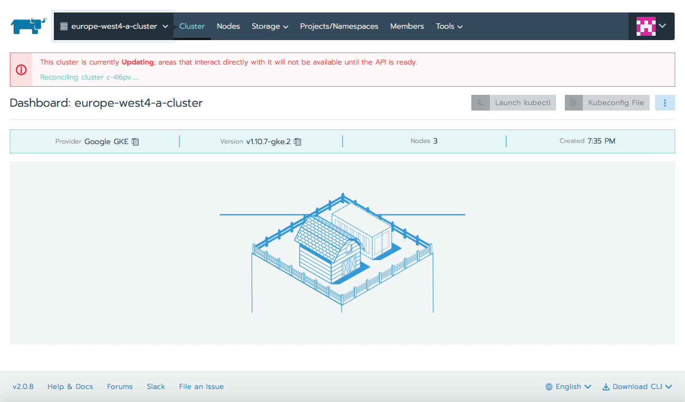

Give this action some time and eventually you should see 5 nodes up and running.
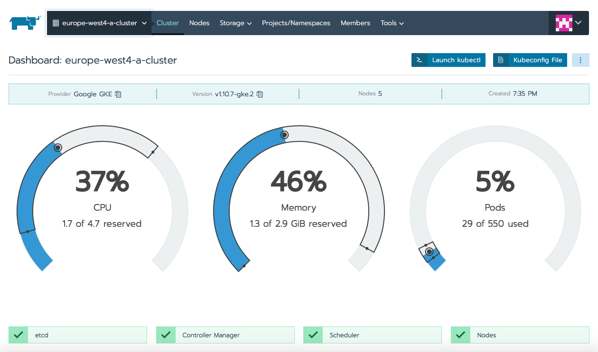

Let's check the `Global` tab, so we can have an overview of all the clusters Rancher is managing.

 
Now we can add more Pods if we want as there are new resources available, let's go to 13.
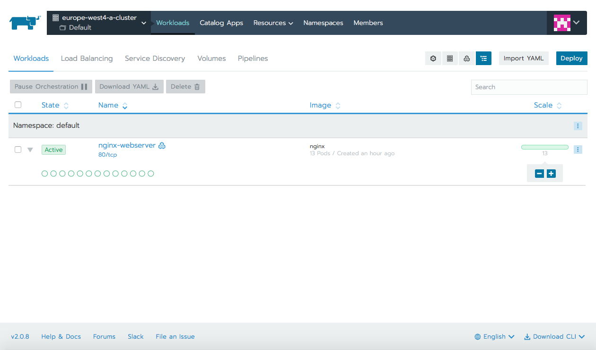

Most important, any of these operations is performed with no downtime. While scaling Pods up or down, or resizing the cluster, hitting the public IP for httpd/nginx Deployment the HTTP response status code was all the time 200.
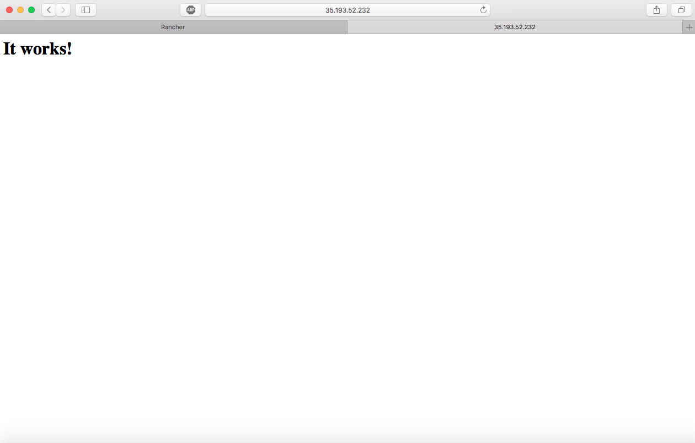
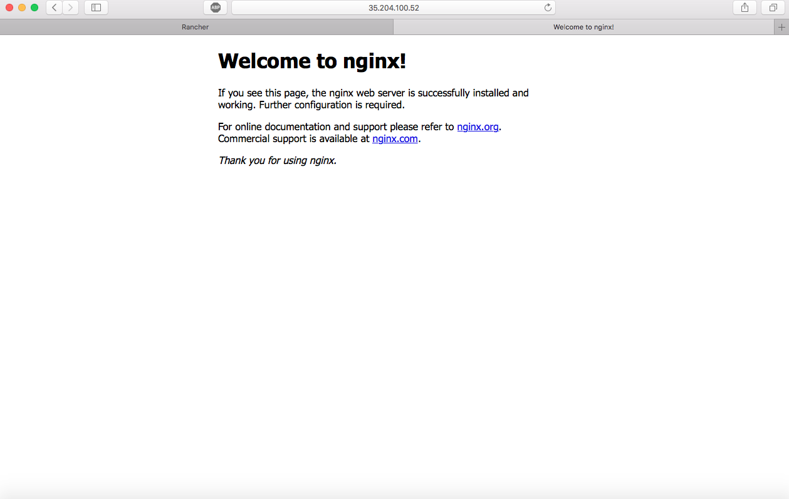

## Conclusion

Let's recap our hands-on scaling exercise:
- we created two clusters using Rancher
- we deployed workloads having a deployment of 1 Pod (nginx) and a deployment of 5 Pods (httpd)
- scaled in/out those two deployments
- resized the cluster

All these actions were done with simple clicks, from [Rancher](https://rancher.com/), making use of the friendly and intuitive UI. You have now a single central point from where you can manage all your kubernetes clusters, observe their state or scale Deployments if needed. If you are looking for a tool to help you with infrastructure management and container orchestration in a hybrid/multi-cloud, multi-region clusters, then [Rancher](https://rancher.com/) might be the perfect fit for you.
